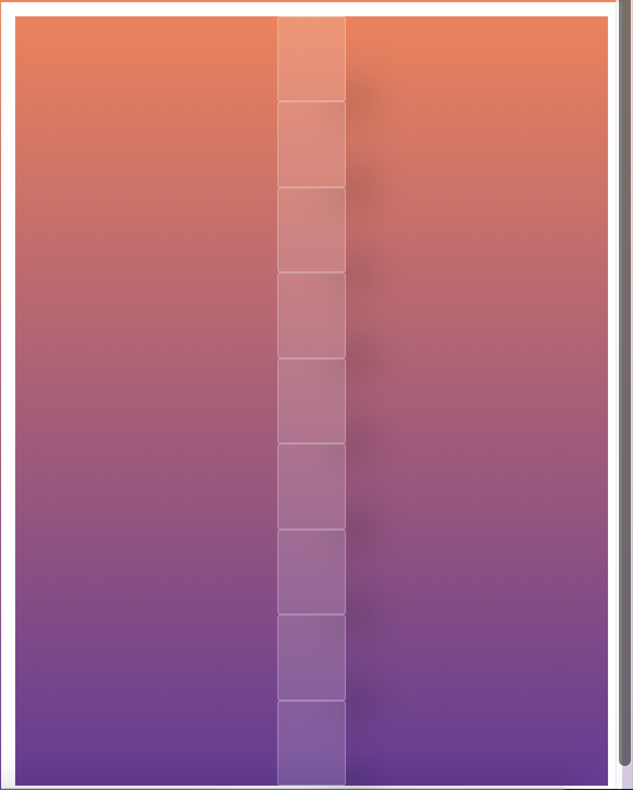

# Grid Pulse

Bruk en kombinasjon av css grid og flexbox for å lage noe liknende som denne!

1. Style boksene (div'ene): sett på bakgrunnsfarge, border, padding, hva annet du måtte ønske.
2. Bruk flexbox for å sentrere boksene.
3. 

* Bruk ``perspective`` for å gi en 3D animasjonsbevegelseseffekt. 
* Definer en animasjon på hver oddetalls div slik at det beveger på seg konstant.
* Definer `animation` i hver partalls div slik at den gjør akkurat det samme som over, men 
* Lag en animasjonssekvens for å gi boksene en større "pulse" effekt. Definer en ``@keyframes`` animasjonsseksens kalt 'pulse' slik at boksene våre beveger seg mer frem og tilbake. 

* Legg gjerne litt skygge på boksene med ``box-shadow``.'  